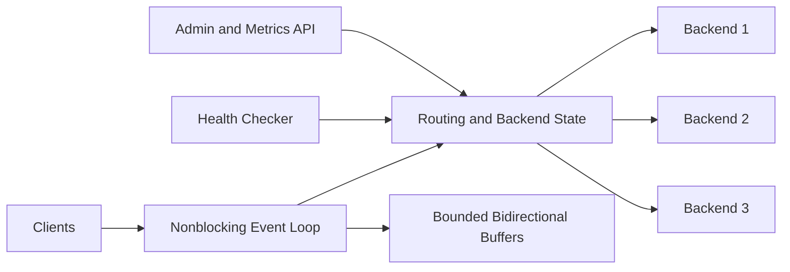

# High-Performance C++ Layer 4 Load Balancer

A C++20 Layer 4 TCP load balancer built with nonblocking sockets and an event-driven I/O loop. Linux uses `epoll`; macOS uses `kqueue`.

The load balancer distributes TCP connections across healthy backends and supports multiple routing policies, active health checks, circuit breaking, graceful draining, bounded backpressure, connection limits, timeouts, and Prometheus-compatible metrics.

## Features

- Nonblocking bidirectional TCP proxying
- `epoll` on Linux and `kqueue` on macOS
- Round-robin, least-connections, and client-IP consistent-hash routing
- Active TCP health checks
- Global and per-backend connection limits
- Circuit breaker with closed, open, and half-open states
- Graceful backend draining through an admin API
- High/low-watermark backpressure
- Backend connection and idle timeouts
- Prometheus-compatible metrics
- Unit tests, concurrent benchmarks, and automated failure testing

## Architecture



A single event-loop thread owns client and backend socket state. It processes only sockets reported as ready by `epoll` or `kqueue`, avoiding one thread per proxied connection.

For each accepted client connection, the load balancer selects an eligible backend, creates a nonblocking backend connection, and forwards data in both directions until completion, failure, or timeout.

## Build

```bash
cmake -S . -B build -DCMAKE_BUILD_TYPE=Release
cmake --build build -j
ctest --test-dir build --output-on-failure
```

## Run

Start three test backends in separate terminals:

```bash
./build/echo-backend 9001 backend-1
```

```bash
./build/echo-backend 9002 backend-2
```

```bash
./build/echo-backend 9003 backend-3
```

Start the load balancer:

```bash
./build/tcp-load-balancer \
  --listen 127.0.0.1:8080 \
  --admin-listen 127.0.0.1:9090 \
  --backend backend-1=127.0.0.1:9001 \
  --backend backend-2=127.0.0.1:9002 \
  --backend backend-3=127.0.0.1:9003 \
  --algorithm round-robin \
  --global-connection-limit 50000 \
  --backend-max-connections 10000 \
  --high-watermark-bytes 1048576 \
  --low-watermark-bytes 524288 \
  --connect-timeout-ms 3000 \
  --idle-timeout-ms 60000 \
  --circuit-failure-threshold 3 \
  --circuit-open-ms 5000
```

Send traffic:

```bash
printf "hello\n" | nc -w 2 127.0.0.1 8080
```

Example response:

```text
backend-1:hello
```

## Routing

Supported algorithms:

```text
round-robin
least-connections
consistent-hash
```

Select an algorithm with:

```bash
--algorithm round-robin
```

### Round robin

Routes each new connection to the next eligible backend.

```bash
for i in {1..6}; do
  printf "hello\n" | nc -w 2 127.0.0.1 8080
done
```

Expected output:

```text
backend-1:hello
backend-2:hello
backend-3:hello
backend-1:hello
backend-2:hello
backend-3:hello
```

### Least connections

Routes each new connection to the eligible backend with the fewest active connections.

### Consistent hash

Uses the client IP as the affinity key. If the preferred backend is unavailable, the load balancer selects another eligible backend.

## Health Checks and Circuit Breaking

Active TCP health checks remove unreachable backends from connection selection.

Repeated backend connection failures open the circuit:

```text
Closed -> Open -> HalfOpen -> Closed
```

While open, the backend receives no new connections. After the configured delay, one half-open probe is allowed. Success closes the circuit; failure reopens it.

Relevant options:

```bash
--circuit-failure-threshold 3
--circuit-open-ms 5000
```

## Graceful Backend Draining

Backend indexes follow the order of the `--backend` arguments, starting at zero.

Drain backend 0 while allowing existing connections to finish:

```bash
curl -X POST http://127.0.0.1:9090/backends/0/drain
```

Reactivate it:

```bash
curl -X POST http://127.0.0.1:9090/backends/0/activate
```

Disable it for new connections:

```bash
curl -X POST http://127.0.0.1:9090/backends/0/disable
```

## Backpressure and Connection Limits

Each proxied connection maintains two bounded buffers:

```text
client -> backend
backend -> client
```

When a buffer reaches the high watermark, reads from the faster side pause. Reads resume after the buffer falls below the low watermark.

```bash
--high-watermark-bytes 1048576
--low-watermark-bytes 524288
```

Global and per-backend connection limits are configured with:

```bash
--global-connection-limit 50000
--backend-max-connections 10000
```

## Metrics

Retrieve Prometheus-compatible metrics:

```bash
curl http://127.0.0.1:9090/metrics
```

The endpoint exposes:

```text
lb_connections_accepted_total
lb_connections_active
lb_connections_closed_total
lb_connections_rejected_total
lb_backend_connect_failures_total
lb_bytes_client_to_backend_total
lb_bytes_backend_to_client_total
lb_backpressure_pauses_total
lb_idle_timeouts_total
lb_backend_healthy
lb_backend_active_connections
lb_backend_connections_total
lb_backend_failures_total
lb_backend_state
```

## Benchmark

The benchmark creates the requested number of concurrent clients. Each client opens one persistent TCP connection and performs sequential request-response exchanges over that connection.

```bash
ulimit -n 100000

python3 tools/benchmark.py \
  --host 127.0.0.1 \
  --port 8080 \
  --clients 400 \
  --requests 1000 \
  --payload-bytes 128
```

It reports:

```text
requests
elapsed_seconds
requests_per_second
p50_ms
p95_ms
p99_ms
mean_ms
```

## Performance Results

Measurements were collected on a MacBook Air using loopback networking, with the benchmark client, load balancer, and three echo backends running on the same machine.

Payload size: `128 bytes`

| Workload | Total requests | Throughput | p50 | p95 | p99 |
|---|---:|---:|---:|---:|---:|
| 400 clients × 1,000 requests | 400,000 | 49.6K req/s | 7.4 ms | 10.2 ms | 14.4 ms |
| 1,000 clients × 1,000 requests | 1,000,000 | 41.2K req/s | 22.0 ms | 33.1 ms | 51.8 ms |
| 2,000 clients × 1,000 requests | 2,000,000 | 38.3K req/s | 47.4 ms | 69.8 ms | 101.5 ms |

Across ten repeated runs at `400 clients × 1,000 requests`, median performance was approximately:

```text
46.4K requests/second
p50: 8.3 ms
p95: 11.4 ms
p99: 15.5 ms
```

## Failure Test

Stop manually started project processes first:

```bash
pkill -f tcp-load-balancer 2>/dev/null || true
pkill -f echo-backend 2>/dev/null || true
```

Run:

```bash
bash tools/failure_test.sh build
```

The script starts three backends and the load balancer, sends traffic, terminates one backend, verifies continued forwarding through healthy backends, and prints health and failure metrics.

## Profiling

Build with optimization and debug symbols:

```bash
cmake -S . -B build-profile \
  -DCMAKE_BUILD_TYPE=RelWithDebInfo

cmake --build build-profile -j
```

On macOS, profile the running load balancer:

```bash
PID=$(pgrep -n tcp-load-balancer)

sample "$PID" 10 \
  -file load-balancer-sample.txt
```

Run a sustained benchmark during sampling, then inspect networking and event-loop call paths:

```bash
grep -E \
"kevent|epoll|accept|connect|read|recv|write|send|Buffer|Session|close|memcpy|memmove" \
load-balancer-sample.txt | head -200
```
